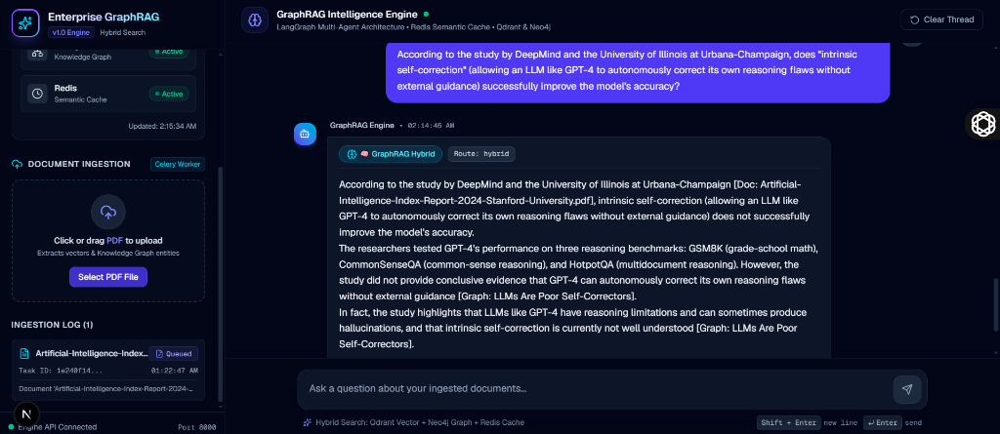
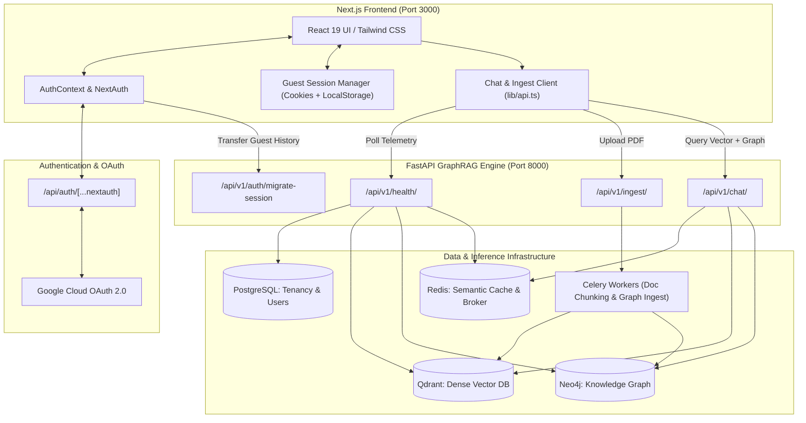
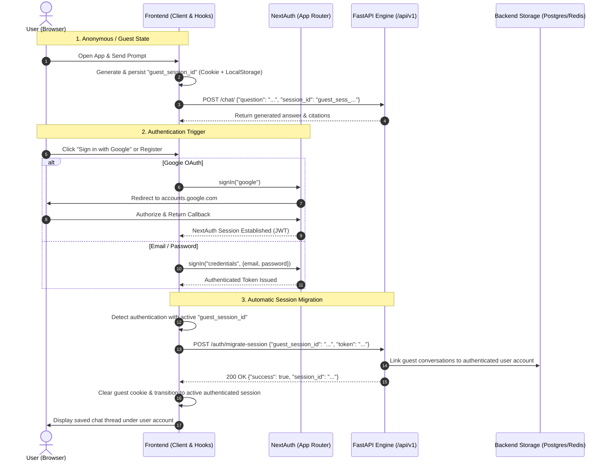
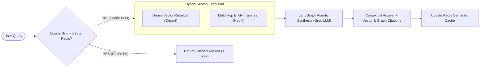

# Enterprise GraphRAG Intelligence Engine — Frontend

An enterprise-grade, responsive AI application interface for the **Enterprise GraphRAG Intelligence Engine**. Built with **Next.js (App Router)**, **TypeScript**, **Tailwind CSS**, and **NextAuth (Auth.js)**, featuring multi-tenant workspace isolation, asynchronous PDF ingestion pipelines, real-time database cluster telemetry, and agentic knowledge retrieval.


---

## 📸 Live Interface Preview



---

## 🏛️ System Architecture

The frontend integrates directly with NextAuth for identity management, local persistence for temporary guest interactions, and a FastAPI backend orchestrating vector searches, graph traversals, and semantic caching.



---

## 🔄 End-to-End Operational Flows

### 1. Guest-to-Authenticated Session Migration Flow

Unauthenticated visitors can query the knowledge engine anonymously. When they register or sign in (via Google OAuth or credentials), their temporary conversation history is automatically transferred to their authenticated account.



### 2. Hybrid GraphRAG Retrieval Pipeline



---

## 🌟 Core Features

- **Guest & Authenticated Chat**: Query the engine anonymously as a guest; conversations automatically migrate to your account upon signing in with Google or Email/Password.
- **Tenant Data Isolation**: Strict partitioning of vector chunks, knowledge graph triples, and chat sessions by `tenant_id`.
- **Hybrid Retrieval Thread**: Displays `⚡ Cache Hit` badges for Redis semantic cache lookups (< 5ms) and `🧠 GraphRAG Hybrid` badges for joint Qdrant + Neo4j retrievals.
- **Collapsible Context Inspector**: Deep inspection of raw retrieved vector chunks (similarity scores, filenames) and knowledge graph triples (subject-predicate-object relations).
- **Asynchronous Document Ingestion**: Drag-and-drop PDF ingestion dispatched to background Celery workers with real-time task tracking.
- **Live Infrastructure Telemetry**: Sidebar monitoring with background health checks for PostgreSQL, Qdrant, Neo4j, and Redis.
- **Flicker-Free Theme System**: Seamless dark and light themes with transition shielding to eliminate UI flashing.

---

## 📁 Project Directory Structure

```text
src/
├── app/
│   ├── api/
│   │   └── auth/
│   │       └── [...nextauth]/
│   │           └── route.ts         # NextAuth GET/POST OAuth & credentials handler
│   ├── globals.css                  # Theme tokens, dark/light styles, scrollbars
│   ├── layout.tsx                   # Root layout, fonts, and metadata
│   ├── page.tsx                     # Main layout & chat workspace assembly
│   └── providers.tsx                # NextAuth SessionProvider & ThemeProvider
├── components/
│   ├── auth/
│   │   ├── AuthModal.tsx            # Multi-tenant login, registration & Google OAuth
│   │   └── Login.tsx                # Standalone credentials and Google sign-in module
│   ├── chat/
│   │   ├── ChatArea.tsx             # Message thread, citations, and context inspector
│   │   └── ChatInput.tsx            # Multiline text input with Shift+Enter submission
│   ├── ingest/
│   │   └── IngestModal.tsx          # Drag-and-drop PDF upload & Celery task log
│   ├── layout/
│   │   ├── Sidebar.tsx              # Sessions list, tenant switcher, health telemetry
│   │   └── ThemeToggle.tsx          # Instant dark/light mode toggle
│   └── settings/
│       ├── SettingsView.tsx         # Workspace settings & tenant management
│       └── WidgetIntegration.tsx    # Embeddable script generator for external sites
├── context/
│   └── AuthContext.tsx              # Authentication state, NextAuth sync, and tenant scope
├── hooks/
│   └── useChatSession.ts            # Guest lifecycle, active session routing, and migration
├── lib/
│   ├── api.ts                       # Fetch client for /health, /ingest, /chat, and migration
│   ├── auth.ts                      # NextAuth options (Google & Credentials providers)
│   ├── guestSession.ts              # Persistent cookie & localStorage guest session manager
│   └── utils.ts                     # Class name merging & timestamp formatters
└── types/
    └── chat.ts                      # TypeScript definitions for chat, health, and ingestion
```

---

## ⚙️ Environment Variables

Configure the following variables in a `.env` or `.env.local` file at the root:

```env
# Backend Base API URL
NEXT_PUBLIC_API_URL=http://127.0.0.1:8000/api/v1
NEXT_PUBLIC_API_BASE_URL=http://127.0.0.1:8000/api/v1

# NextAuth Configuration
NEXTAUTH_URL=http://localhost:3000
NEXTAUTH_SECRET=9f7a3e21c8b45d07a16e89f234b67c81d09e5a32b78f14c2e69a03b57d81ef2a

# Google OAuth Provider (Google Cloud Console -> Credentials -> OAuth 2.0 Client IDs)
GOOGLE_CLIENT_ID=your-google-client-id.apps.googleusercontent.com
GOOGLE_CLIENT_SECRET=your-google-client-secret
```

> [!IMPORTANT]
> **Google Cloud Console Settings**:
> Add the following to your **Authorized redirect URIs**:
> `http://localhost:3000/api/auth/callback/google`

---

## 🔗 Backend API Contract

Base URL: `http://127.0.0.1:8000/api/v1`

| Endpoint | Method | Payload / Params | Description |
| :--- | :---: | :--- | :--- |
| `/health/` | `GET` | — | Returns health status for PostgreSQL, Qdrant, Neo4j, and Redis. |
| `/ingest/` | `POST` | `multipart/form-data` (`file`, `tenant_id`) | Uploads PDF document and dispatches Celery background worker. |
| `/chat/` | `POST` | `{"question", "session_id", "tenant_id"}` | Hybrid GraphRAG query execution with semantic caching. |
| `/auth/migrate-session` | `POST` | `{"guest_session_id", "token"}` | Reassigns guest conversation history to the authenticated user. |

---

## 🛠️ Getting Started

### Prerequisites

- **Node.js**: v18.0.0 or higher
- **npm**: v9.0.0 or higher
- **Backend Service**: FastAPI backend running on `http://127.0.0.1:8000`

### 1. Installation

```bash
# Clone the repository and navigate into the directory
cd graph_rag_enterprise_engine_frontend

# Install dependencies
npm install
```

### 2. Run Development Server

```bash
npm run dev
```

Open [http://localhost:3000](http://localhost:3000) in your browser.

### 3. Production Build

```bash
# Compile and optimize production bundle
npm run build

# Start production server
npm run start
```
